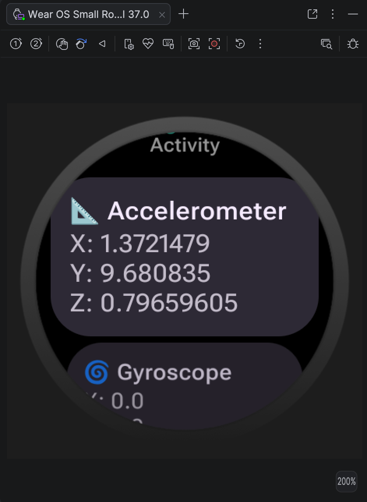
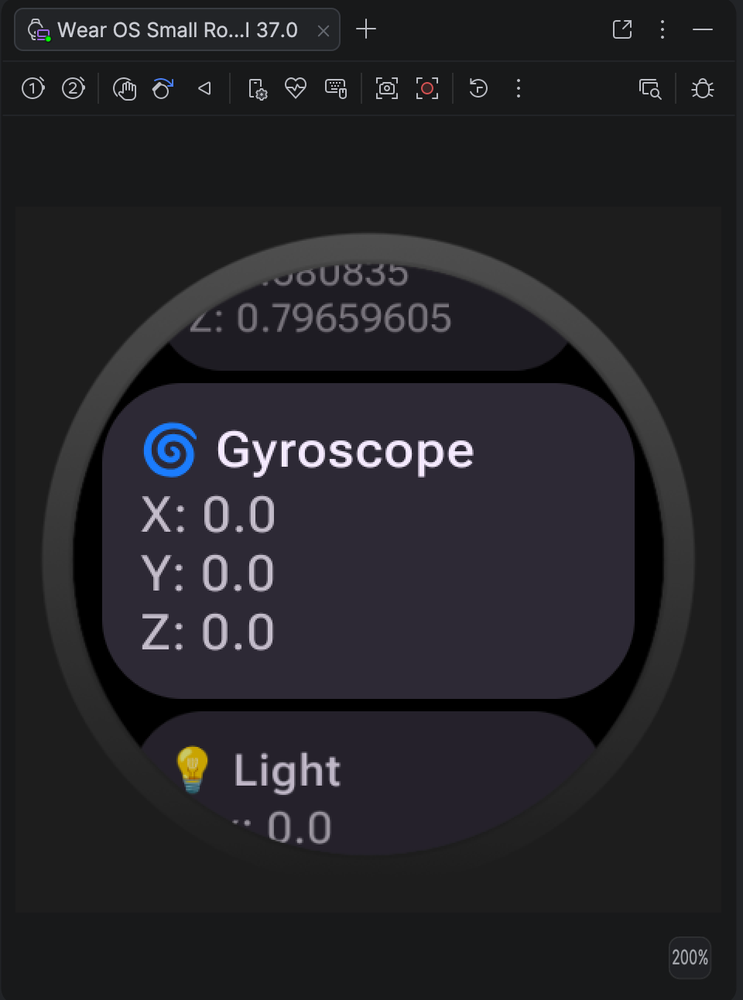
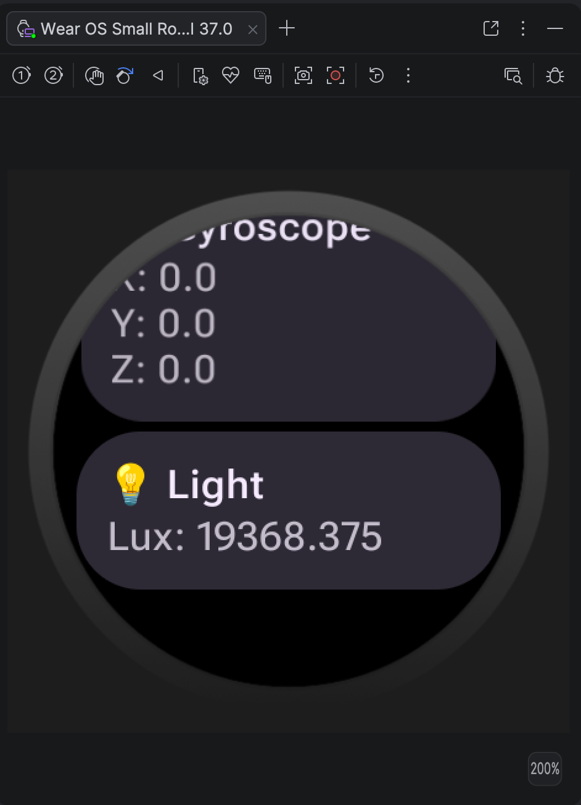
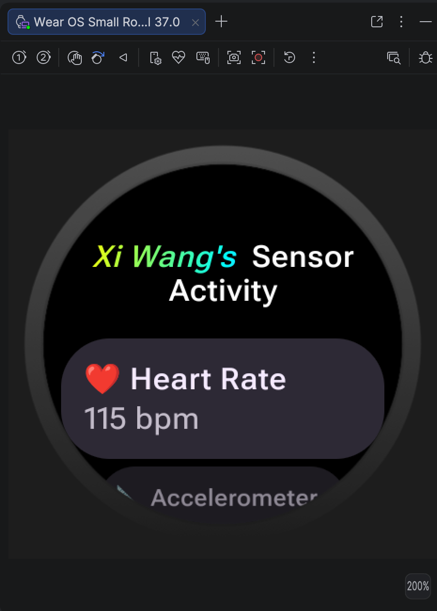
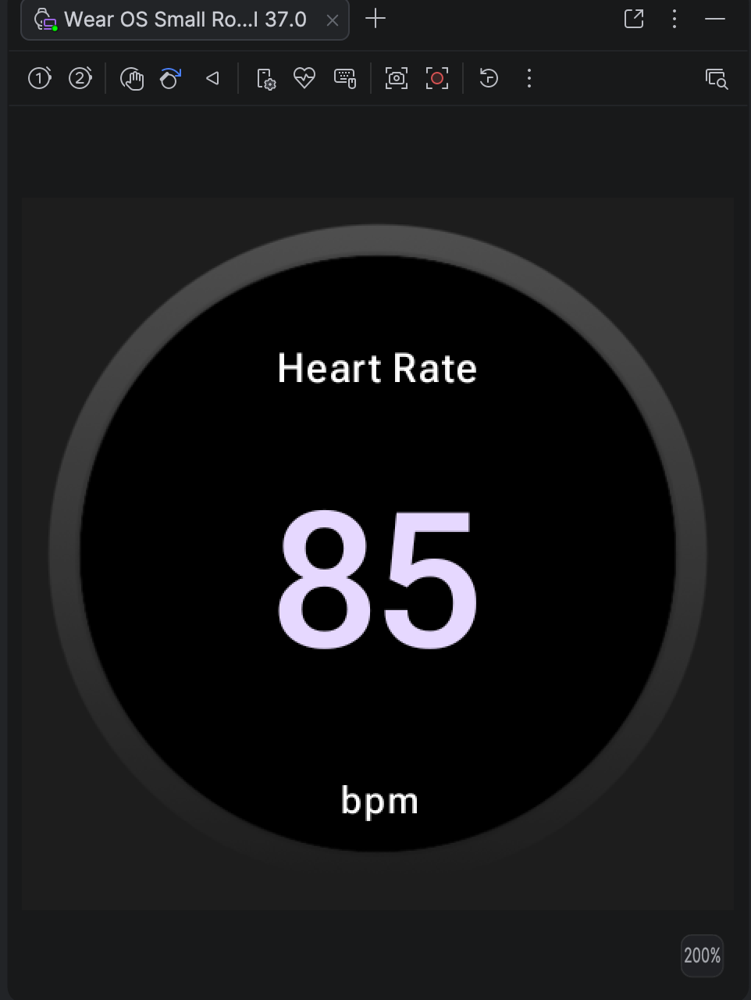
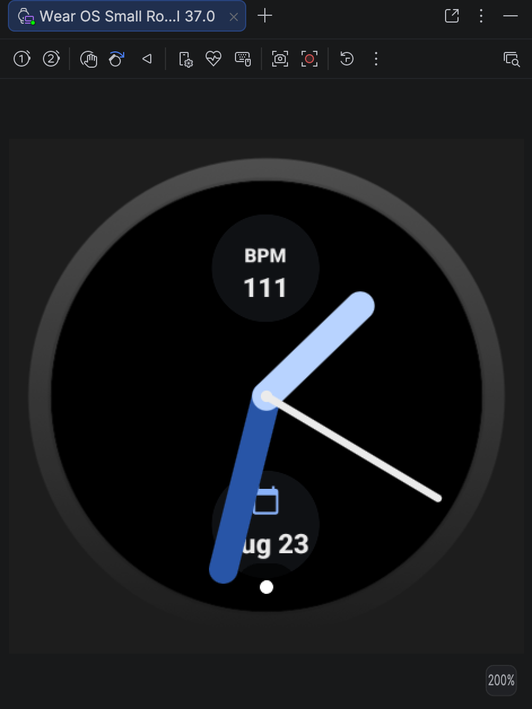

# Assignment Two: Wear OS and Sensors

Author: Xi Wang

## Part A: Setup your Wear OS App

The screenshot of these two activity

- Main Activity:

- Sensor Activity:


I use the [`ScalingLazyColum`](https://developer.android.com/reference/kotlin/androidx/wear/compose/material/ScalingLazyColumn.composable#ScalingLazyColumn(androidx.compose.ui.Modifier,androidx.wear.compose.material.ScalingLazyListState,androidx.compose.foundation.layout.PaddingValues,kotlin.Boolean,androidx.compose.foundation.layout.Arrangement.Vertical,androidx.compose.ui.Alignment.Horizontal,androidx.compose.foundation.gestures.FlingBehavior,kotlin.Boolean,androidx.wear.compose.material.ScalingParams,androidx.wear.compose.material.ScalingLazyListAnchorType,androidx.wear.compose.material.AutoCenteringParams,kotlin.Function1)) for the Sensor Activity's layout. For the navigation, I just use the `Assignment One` as a reference.   

## Part B: Connect to one Sensor

<strong>Accelerometer:</strong>


I use [`Card`](https://developer.android.com/reference/kotlin/androidx/wear/compose/material/TitleCard.composable#TitleCard(kotlin.Function0,kotlin.Function1,androidx.compose.ui.Modifier,kotlin.Boolean,kotlin.Function1,androidx.compose.ui.graphics.painter.Painter,androidx.compose.ui.graphics.Color,androidx.compose.ui.graphics.Color,androidx.compose.ui.graphics.Color,kotlin.Function1)) for showcase the information of accelerometer.

## Part C: Connect to three Sensors

<strong>Accelerometer</strong>



<strong>Gyroscope</strong>


<strong>Light</strong>


## Part D: Integrate Health Services



Compared to `SensorManager`, the Health Services API saves battery and has strict runtime permissions, such as `BODY_SENSORS` and `READ_HEART_RATE`. The `Health Services API` includes three kinds of clients: `MeasureClient` for spot measurements, `ExerciseClient` for active workout, and `PassiveMonitoringClient` for background health monitoring.

To implement this part, I stuck at get heart rate and part after using the code on ['Take spot health measurements with MeasureClient'](https://developer.android.com/health-and-fitness/health-services/active-data/measure-client) documents. I ask Gemini with the prompt `How to test the data`

## Part E: Add a Tile and Complication

I use the prompt `How to add a tile to showcase the heart rate? Can you give me an example?`

<strong>Tile</strong>



I use the prompt `How to add a complication to showcase the heart rate? Can you give me an exmaple?`

After I get the code, it is unable to run with an error:
```
Error running 'app.HeartRate ComplicationService'
Complications run configurations are currently not supported on API 34+.
Please run the configuration on a device with API 33 or less.
```

I asked one more time with `How to deal with this problem?`

<strong>Complication</strong>


