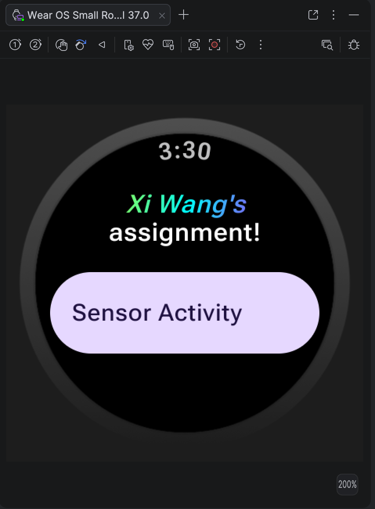
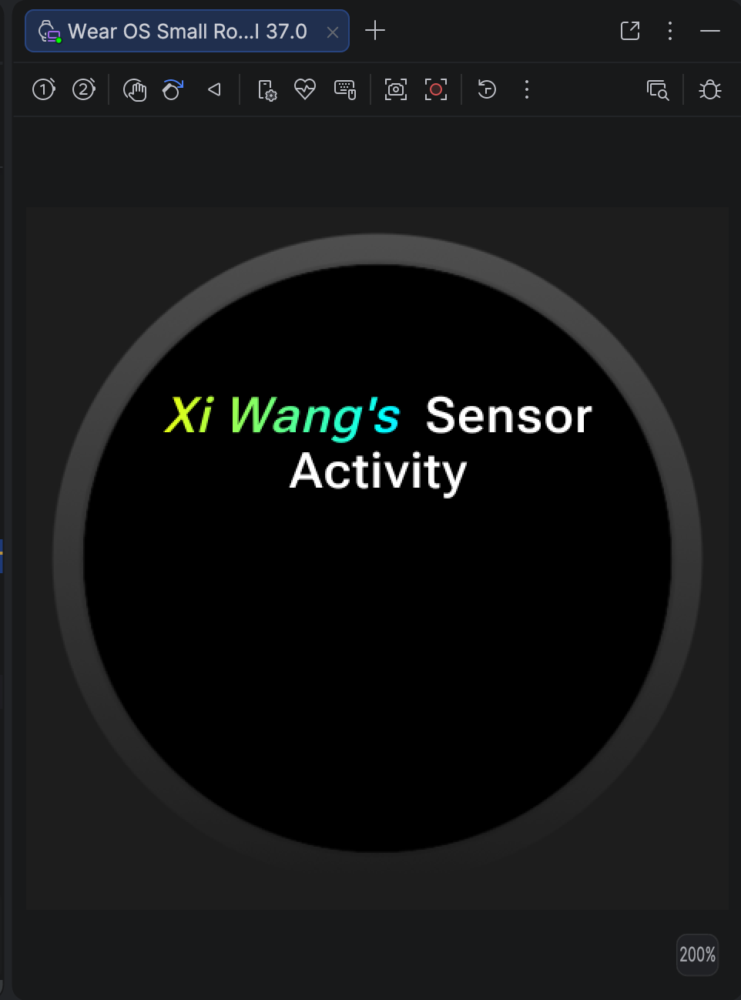
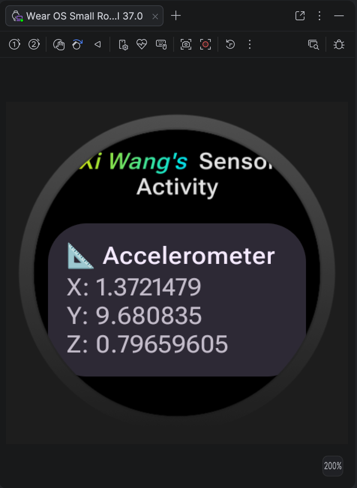

# Assignment Two: Wear OS and Sensors

Author: Xi Wang

## Part A: Setup your Wear OS App

The screenshot of these two activity

- Main Activity:

- Sensor Activity:


I use the [`ScalingLazyColum`](https://developer.android.com/reference/kotlin/androidx/wear/compose/material/ScalingLazyColumn.composable#ScalingLazyColumn(androidx.compose.ui.Modifier,androidx.wear.compose.material.ScalingLazyListState,androidx.compose.foundation.layout.PaddingValues,kotlin.Boolean,androidx.compose.foundation.layout.Arrangement.Vertical,androidx.compose.ui.Alignment.Horizontal,androidx.compose.foundation.gestures.FlingBehavior,kotlin.Boolean,androidx.wear.compose.material.ScalingParams,androidx.wear.compose.material.ScalingLazyListAnchorType,androidx.wear.compose.material.AutoCenteringParams,kotlin.Function1)) for the Sensor Activity's layout. For the navigation, I just use the `Assignment One` as a reference.   

## Part B: Connect to one Sensor

<strong>Accelerometer:</strong>



I use [`Card`](https://developer.android.com/reference/kotlin/androidx/wear/compose/material/TitleCard.composable#TitleCard(kotlin.Function0,kotlin.Function1,androidx.compose.ui.Modifier,kotlin.Boolean,kotlin.Function1,androidx.compose.ui.graphics.painter.Painter,androidx.compose.ui.graphics.Color,androidx.compose.ui.graphics.Color,androidx.compose.ui.graphics.Color,kotlin.Function1)) for showcase the information of accelerometer.

## Part C: Connect to three Sensors

<strong>Accelerometer</strong>


<strong>Gyroscope</strong>


<strong>Light</strong>


### Part D: Integrate Health Services

Compared to sensor, health services use low battery and require permission.

I follow the guidance of documentation on this page: https://developer.android.com/health-and-fitness/health-services/active-data/measure-client

However, the `await()` method is error in my project.

I ask Gemini for the prompt `How to deal with await here`?

Gemini replies I should add another dependency, which is
```kotlin
implementation("org.jetbrains.kotlinx:kotlinx-coroutines-guava:1.7.3")
``` 
and import 
```kotlin
import kotlinx.coroutines.guava.await
````

`Register the callback` and `Unregister the callback` part is also unusable with the `Function deculration must have a name` error. Therefore, I ask `How to deal with the errorr`

AI response code example:
```
class SensorActivity : ComponentActivity(), SensorEventListener {
    private lateinit var sensorManager: SensorManager
    private var accelerometer: Sensor? = null
    private var gyroscope: Sensor? = null
    private var light: Sensor? = null
    private var map = mutableStateMapOf<String, FloatArray?>()

    private var supportsHeartRate: Boolean = false
    private var heartRateBpm by mutableStateOf<Double?>(null) // Latest heart rate value, for Compose UI

    private val healthClient by lazy { HealthServices.getClient(this) }
    private val measureClient by lazy { healthClient.measureClient }

    // 1. Check whether the device supports heart rate measurement
    private fun checkHeartRateCapability() {
        lifecycleScope.launch {
            val capabilities = measureClient.getCapabilitiesAsync().await()
            supportsHeartRate = DataType.HEART_RATE_BPM in capabilities.supportedDataTypesMeasure
            if (supportsHeartRate) {
                observeHeartRate()
            }
        }
    }

    // 2. Wrap the callback-based API into a Flow
    private fun heartRateFlow(): Flow<DataPointContainer> = callbackFlow {
        val heartRateCallback = object : MeasureCallback {
            override fun onAvailabilityChanged(
                dataType: DeltaDataType<*, *>,
                availability: Availability
            ) {
                if (availability is DataTypeAvailability) {
                    // Handle availability change
                }
            }

            override fun onDataReceived(data: DataPointContainer) {
                trySend(data) // Emit the data into the Flow
            }
        }

        measureClient.registerMeasureCallback(DataType.HEART_RATE_BPM, heartRateCallback)

        awaitClose {
            runBlocking {
                measureClient.unregisterMeasureCallbackAsync(
                    DataType.HEART_RATE_BPM,
                    heartRateCallback
                )
            }
        }
    }

    // 3. Collect the Flow inside a coroutine
    private fun observeHeartRate() {
        lifecycleScope.launch {
            heartRateFlow().collect { data ->
                // Extract the heart rate value from data and update UI state
                // Example: heartRateBpm = data.getData(DataType.HEART_RATE_BPM).firstOrNull()?.value
            }
        }
    }

    override fun onCreate(savedInstanceState: Bundle?) {
        super.onCreate(savedInstanceState)
        setContent {
            SensorPage()
        }

        sensorManager = getSystemService(SENSOR_SERVICE) as SensorManager
        accelerometer = sensorManager.getDefaultSensor(Sensor.TYPE_ACCELEROMETER)
        gyroscope = sensorManager.getDefaultSensor(Sensor.TYPE_GYROSCOPE)
        light = sensorManager.getDefaultSensor(Sensor.TYPE_LIGHT)

        checkHeartRateCapability() // Trigger the capability check + subscription here
    }

    // ... onResume/onPause/onSensorChanged/SensorPage remain unchanged
}
```

When I implement these code, the heart rate cannot correct showed.